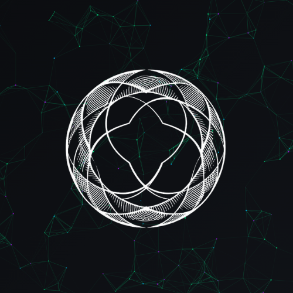

<div align="center">
  

  # ConjureAI - AI Developer Agent Platform

  [](https://nextjs.org/)
  [](https://www.typescriptlang.org/)
  [](https://openai.com/)

  <p>The platform for AI developer agents. Describe what you want to build and watch it become reality</p>
  
</div>

<div align="center">
  <h3>
    <a href="#features">Features</a>
    <span> · </span>
    <a href="#getting-started">Getting Started</a>
    <span> · </span>
    <a href="#ai-agents">AI Agents</a>
    <span> · </span>
    <a href="#tech-stack">Tech Stack</a>
    <span> · </span>
    <a href="#contributing">Contributing</a>
    <span> · </span>
    <a href="https://x.com/conjureai">Twitter</a>
    <span> · </span>
    <a href="https://conjureai.gitbook.io/">Docs</a>
    <span> · </span>
    <a href="https://pump.fun/coin/H1gbUutzF1gHqbV91MPxk6YkGEDdiFm44iiUWdwMpump">Pump.fun</a>
  </h3>
</div>

## CA
- $CNJR: H1gbUutzF1gHqbV91MPxk6YkGEDdiFm44iiUWdwMpump

## Features

- 🤖 Advanced AI Agents specialized in web and game development
- 🎮 Real-time code generation and preview
- 📊 Detailed technical analysis and metrics
- 🔄 Live deployment capabilities
- 📱 Responsive design across all devices

## Getting Started

1. Clone the repository:

# Install backend dependencies
```console
npm install
```

# Install frontend dependencies
```console
cd frontend
npm install
```

2. Set up environment variables:

# Backend (.env)
OPENAI_API_KEY=your_api_key
PORT=3001

# Frontend (.env.local)
NEXT_PUBLIC_API_URL=http://localhost:3001

3. Run the development servers:

# Backend
```console  
npm run dev
```

# Frontend (in a new terminal)
```console
cd frontend
npm run dev
```

## AI Agents

### Neo Blackwood - Web Development Specialist
<div align="center">
  
</div>

- **Version**: 5.1.0
- **Expertise**: Architecture, Frontend Development, UI/UX Design
- **Specialties**: 
  - Robust backend systems
  - Visionary frontend experiences
  - Cutting-edge architectural strategies

### Dave "Bitmap" Wilson - Game Development Expert
<div align="center">
  
</div>

- **Version**: 3.8.9
- **Expertise**: Game Logic, Physics Systems, Graphics
- **Specialties**:
  - Game mechanics optimization
  - Physics system implementation
  - High-performance rendering

## Tech Stack

### Frontend
- Next.js 14
- TypeScript
- Tailwind CSS
- Framer Motion

### Backend
- Node.js
- Express
- OpenAI API
- AWS S3

## Contributing

1. Fork the repository
2. Create your feature branch (`git checkout -b feature/amazing-feature`)
3. Commit your changes (`git commit -m 'Add some amazing feature'`)
4. Push to the branch (`git push origin feature/amazing-feature`)
5. Open a Pull Request


## Community & Resources

<div align="center">
  <a href="https://github.com/utxobro/conjure">
    
  </a>
  <a href="https://x.com/conjureai">
    
  </a>
  <a href="https://conjureai.gitbook.io/">
    
  </a>
  <a href="https://pump.fun/coin/H1gbUutzF1gHqbV91MPxk6YkGEDdiFm44iiUWdwMpump">
    
  </a>
</div>

---
